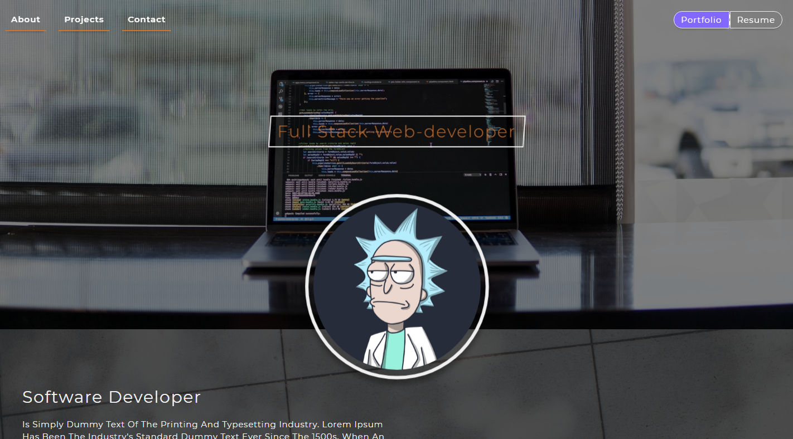

# Porfolio
My Portfolio and Resume.

## live Demo

checkout live demo here: https://ourandco.github.io/My-Portfolio/

## Languages
- HTML5
- CSS3

### Resources
- Google Fonts
- unsplash.com

##### Sass, NPM, BEM METHADOLOGY, Live-Sever

### Setup

1. Clone this repo to your computer using `git clone`
2. Run `npm install` to install all the dependencies.
3. Open index.html from the dist folder on the local Live server to run the app.

#### Author
:bust_in_silhouette: Alamgir

## Show your support

Give a ⭐️ if you like this project

## 🤝 Contributing

Contributions, issues and feature requests are welcome!

#### Copyrights

- Free to use.
